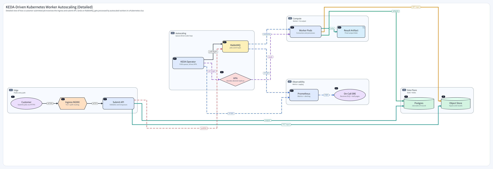

# DrawFlow MCP

[English](README.md) · [한국어](README.ko.md)

**에이전트를 위한 플러그형 아키텍처 다이어그램 생성기.** DrawFlow MCP는 선언형 그래프 문서를 깔끔한 아키텍처 PNG와 마크다운 디테일 시트 두 장으로 바꿔주는 단일 MCP 도구를 제공합니다. 작성 규칙, 레이아웃 엔진, 엣지 라우터, 다운로드 엔드포인트가 한 서버 안에 모두 들어 있어서 — 에이전트에 꽂고 다이어그램을 요청만 하면 됩니다.



## Why

LLM은 시스템을 글로 얼마든지 설명하지만, 그걸 읽기 쉬운 다이어그램으로 옮기는 일은 여전히 draw.io / Excalidraw / Mermaid에서 손으로 그리고 좌표를 만지고 export 하는 수작업입니다. DrawFlow MCP는 그 루프를 닫아줍니다:

- **도구 한 번에 PNG 두 장.** `GraphDocument`를 넘기면 간결한 아키텍처 이미지와 긴 디테일 이미지를 받습니다.
- **스킬이 함께 배포됩니다.** 에이전트는 같은 서버에서 작성 가이드(`SKILL.md`)를 `GET` 으로 받아갑니다 — 노드 밀도 예산, 클러스터 응집 규칙, 라인 타입 의미, 글자수 한도까지 — 렌더러에 맞춰 작성하지, 추측하지 않습니다.
- **레이아웃은 자동.** Compound Sugiyama (grandalf)가 rank와 클러스터를 처리하고, 자체 직교 라우터가 포트 인지 진입/이탈, 엣지별 채널 할당, 장애물을 피하는 꺾임, 교차 엣지 자동 색상 분리까지 처리합니다. 좌표나 waypoint는 필요 없고 — 노드, 엣지, 클러스터만 선언하면 됩니다.
- **마크다운 디테일, 잘리거나 자동 확장.** 노드/엣지별 prose 가 카드 레이아웃으로 쌓입니다. `output.details.autoGrow=true` 를 주면 잘리지 않고 캔버스가 늘어나서 다 보여줍니다.
- **단일 프로세스 또는 분리.** HTTP 트랜스포트로 MCP 엔드포인트와 다운로드 라우트를 한 서버가 모두 호스팅하거나, Codex/IDE 설정에 꽂을 거면 stdio 트랜스포트로 띄울 수 있습니다.

## 구성요소

- **MCP 서버** — `drawflow_mcp.server`, FastMCP 기반, `http` / `streamable-http` / `sse` / `stdio` 트랜스포트 지원.
- **두 개의 도구** —
  - `get_drawflow_skill` 은 `SKILL.md` 본문을 인라인으로 돌려줍니다 (검증용 다운로드 URL 과 SHA-256 도 함께).
  - `create_diagram_png` 은 `drawflow.graph/v1` 문서를 받아 PNG 두 장의 URL을 돌려줍니다.
- **번들된 스킬** — `skills/drawflow/SKILL.md` 가 작성 계약서입니다: 도구 입력 형태, 노드 밀도 예산, 클러스터 규칙, 라인 타입, 라벨 한도, 반환 스키마, 긴 detail prose 를 위한 `autoGrow` 워크어라운드까지 모두 포함.
- **레이아웃 + 렌더 파이프라인** — Pillow 기반, grandalf Sugiyama 레이아웃, 포트 라우팅 직교 엣지, 평행 중첩을 막는 lane-claim 누적기, CJK 폰트 기본 탑재.
- **다운로드 엔드포인트** — `/downloads/skills/drawflow/{version}/SKILL.md` 가 작성 계약서를, `/downloads/diagrams/{artifactId}.png` 가 렌더된 PNG를 서빙합니다. artifact id 는 80-bit 무작위 hex 라 URL 추측은 사실상 불가능합니다.

## 요구사항

- Python 3.11+
- `uv`

## 빠른 시작

```powershell
uv sync
uv run python -m drawflow_mcp.server --transport http --host 127.0.0.1 --port 8765
```

이걸로 끝입니다. 서버는 다음을 호스팅합니다:

| 엔드포인트 | 용도 |
|---|---|
| `http://127.0.0.1:8765/mcp/`                                          | MCP RPC (streamable-http transport) |
| `http://127.0.0.1:8765/downloads/skills/drawflow/<version>/SKILL.md`  | 에이전트용 작성 가이드 |
| `http://127.0.0.1:8765/downloads/diagrams/<artifactId>.png`           | 렌더된 PNG (graph 또는 details) |
| `http://127.0.0.1:8765/health`                                        | Liveness 체크 |

`DRAWFLOW_PUBLIC_BASE_URL` 은 `--host`/`--port` 에서 자동 도출됩니다. 리버스 프록시 뒤에 두는 경우에만 명시적으로 지정하세요.

### Stdio 트랜스포트

stdio로 서버를 spawn 하는 도구(Codex, IDE 등)용:

```powershell
$env:DRAWFLOW_PUBLIC_BASE_URL = "http://127.0.0.1:8765"
uv run python -m drawflow_mcp.server --transport stdio
```

stdio 모드에서는 서버에 자체 HTTP 리스너가 없으므로, 다운로드 URL은 같은 artifact 디렉터리를 공유하는 별도의 HTTP 인스턴스를 가리켜야 합니다.

## 에이전트 연결

MCP 호환 클라이언트라면 어디든 마운트할 수 있습니다. Codex / Claude Desktop 류의 최소 설정 예시:

```toml
[mcp_servers.drawflow]
command = "uv"
args = ["run", "python", "-m", "drawflow_mcp.server", "--transport", "stdio"]
env = { DRAWFLOW_PUBLIC_BASE_URL = "http://127.0.0.1:8765" }
```

마운트 후 에이전트의 작업 흐름:

1. `get_drawflow_skill` 을 호출하고 응답의 `skill.markdown` 을 읽는다 (작성 계약서가 인라인으로 들어 있음. 파일로 받고 싶으면 `skill.downloadUrl` 사용).
2. 스킬에 따라 `GraphDocument` 를 작성한다 (3–5개 클러스터, 8–12개 foreground 노드, 관계 본질에 맞는 라인 타입, 짧은 라벨, 긴 설명은 `detail` 에).
3. `{"diagram": GraphDocument, "output": {...}}` 형태로 `create_diagram_png` 를 호출한다.
4. 받은 두 URL을 사용자에게 전달한다.

## 도구

### `get_drawflow_skill`

```jsonc
// 인자
{ "version": "latest", "client": "codex" }

// 결과
{
  "skill": {
    "name": "drawflow-diagram",
    "version": "0.1.0",
    "downloadUrl": "http://.../downloads/skills/drawflow/0.1.0/SKILL.md",
    "sha256": "...",
    "markdown": "# DrawFlow Diagram Skill\n\nUse this skill when ..."  // SKILL.md 본문 인라인
  },
  "usage": "Use this skill to create DrawFlow Graph DSL, then call create_diagram_png."
}
```

`markdown` 필드에는 `SKILL.md` 의 본문이 통째로 들어 있어서, 에이전트가 별도 HTTP fetch 없이 바로 읽을 수 있습니다. `downloadUrl` 은 streamed `text/markdown` 응답을 선호하거나 `sha256` 으로 검증하고 싶은 클라이언트를 위해 함께 제공됩니다.

### `create_diagram_png`

```jsonc
// 인자
{
  "diagram": { /* drawflow.graph/v1 GraphDocument */ },
  "output": {
    "graph":   { "width": 2200, "height": 1300, "scale": 1 },
    "details": { "width": 1500, "maxHeight": 7000, "scale": 1, "autoGrow": true }
  }
}

// 결과
{
  "status": "ready",
  "downloads": [
    { "role": "graph",   "url": "http://.../dg_….png", "image": { "width": 2200, "height": 1300, "scale": 1 } },
    { "role": "details", "url": "http://.../dg_….png", "image": { "width": 1500, "height": 5260, "scale": 1 } }
  ],
  "warnings": []
}
```

전체 스키마, 라벨/글자수 한도, 라인 타입 표, 클러스터 응집 규칙, 백엣지 처리 규칙은 `skills/drawflow/SKILL.md` 에 있습니다 — 이 파일이 곧 작성 계약서입니다.

## Docker

```powershell
docker compose up --build drawflow
```

배포 이미지에는 Noto CJK 폰트가 번들되어 있어 Linux 컨테이너 안에서도 한국어/일본어/중국어가 PNG에 정상 렌더됩니다.

## 프로젝트 구조

```
drawflow_mcp/
  server.py              — 통합 FastMCP 진입점 (도구 + custom_route 다운로드)
  pipeline.py            — validate → layout → render → URL
  models/                — Pydantic GraphDocument / OutputSpec 계약
  rendering/
    layered_layout.py    — grandalf 기반 compound Sugiyama 레이아웃
    graph.py             — 직교 포트 라우팅, 채널/lane 할당
    details.py           — 마크다운 인지 카드 레이아웃 (autoGrow 포함)
    shapes.py, arrows.py, text.py, theme.py
skills/drawflow/SKILL.md — 번들된 작성 계약서
docs/design.md           — 아키텍처/렌더링 메모
```

## License

[MIT](LICENSE)
